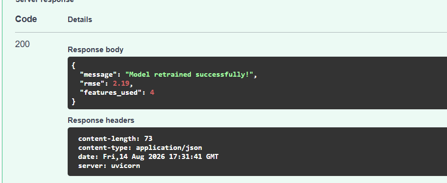

# supply-prescript-analytics

🚀 Exciting Update: Kickstarting my Internship at Alxero Solutions!

I am thrilled to share that I have officially started my internship journey with the team at Alxero Solutions! For my primary project, I will be building SupplyPrescript—a Closed-Loop Prescriptive Analytics platform tailored for Supply Chain Operations & Operations Research. 📦🤖

Most modern dashboards tell you what happened or predict what will happen, but they stop short of telling the operator what to do. SupplyPrescript bridges this gap by combining machine learning with mathematical optimization to suggest optimal operational alternatives (like air freight vs. secondary sourcing) when disruptions hit, while continuously learning from the real-world outcomes of human decisions.

🎯 Week 1 Milestones Achieved:

Data Engineering: Developed a synthetic operational dataset mimicking supplier reliability metrics, distances, and real-world bottleneck factors.

Predictive Baseline: Built and optimized an XGBoost Regressor prototype to forecast precise shipping delays in days.

Data Architecture: Fully mapped out and initialized a relational transactional database schema (shipments, prescriptions, and executed_decisions) to anchor our write-back pipeline.


📦 Week 2: Mathematical Optimization & Prescriptive Analytics

This notebook extends the delay prediction system by adding a prescriptive analytics layer using Mathematical Optimization (Linear Programming).

🎯 Objective

When a delay is predicted, the system should:

Evaluate multiple corrective actions
Optimize decision-making under constraints
Recommend the best strategies based on Cost vs Speed trade-offs
🧠 Approach
1. Business Constraints Defined

The model incorporates real-world constraints such as:

Budget limitations 💰
Maximum allowable delay reduction ⏱️
Feasible action combinations
2. Optimization Model

We use Linear Programming (SciPy) to:

Minimize total cost OR delay impact
Generate multiple strategies:
Low Cost Strategy
Fast Delivery Strategy
Balanced Strategy
3. Decision Variables

Each possible action is treated as a binary variable:

Expedite shipping 🚚
Use backup supplier 🏭
Increase inventory 📦
4. Output (Prescriptive Recommendations)

For each strategy, the system provides:

Selected actions ✅
Total cost 💰
Time impact ⏱️
Trade-off explanation ⚖️

🔄 Workflow
Predict delay (Week 1 model)
Trigger optimization if delay detected
Generate best alternative strategies
Display actionable insights
🚀 Key Highlights

✔️ Combines Predictive + Prescriptive Analytics
✔️ Real-world business decision modeling
✔️ Multi-strategy optimization
✔️ Clear trade-off visualization

📌 Conclusion

This module demonstrates how optimization techniques can be used to:

Improve operational efficiency
Reduce delays
Support intelligent decision-making in supply chain/logistics systems


## Week 2 – Mathematical Optimization

In Week 2, I implemented the **Mathematical Optimization and Prescriptive Analytics** component of the Supply Prescript project.

### Key Activities

* Defined business constraints such as **maximum budget, delivery time, and inventory requirements**.
* Implemented a **SciPy Linear Programming** model to optimize possible supply chain decisions.
* Generated the **top 3 alternative actions** when a shipment delay was predicted.
* Compared different strategies based on their **cost and delivery speed**.
* Developed a **Prescriptive UI** to display the recommended actions as easy-to-understand cards.
* Clearly highlighted the **Cost vs. Speed trade-offs** for each recommended option.
* Provided multiple strategies such as **Low Cost, Fast Delivery, and Balanced** options to support business decision-making.

### Outcome

The optimization engine successfully generates alternative actions based on defined business constraints. The Prescriptive UI presents these options along with their **cost and speed trade-offs**, helping analysts choose the most suitable action when a delay is predicted.


## Week 3 – The Closed Loop

In Week 3, I implemented the **Closed Loop evaluation system** for the Supply Prescript project.

### Key Activities

* Developed an evaluation script to compare the **predicted outcome/cost of the selected decision** with the **actual historical outcome**.
* Stored the actual business outcomes and feedback for further analysis.
* Evaluated the performance of the AI-generated recommendations based on the difference between predicted and actual results.
* Implemented a **Feedback UI** to track the effectiveness of the recommendations.
* Added **Decision ROI analytics** to monitor how frequently the AI's recommendations resulted in positive business outcomes.
* Stored multiple decision outcomes to support continuous evaluation and improvement of the system.

### Outcome

The Closed Loop system successfully records actual outcomes and evaluates AI recommendations against real results. This provides feedback that can be used to measure **Decision ROI** and improve future recommendations.


## Week 4 – Continuous Learning & Workflow Refinement

In Week 4, I implemented the **Continuous Learning pipeline** to enable the Supply Prescript system to learn from discrepancies identified during the Closed Loop evaluation.

### Key Activities

* Implemented a **Continuous Learning pipeline** to monitor differences between predicted and actual outcomes.
* Used feedback and evaluation results to identify significant **prediction discrepancies**.
* Configured the system to trigger **XGBoost model retraining** when the prediction error exceeds the defined threshold.
* Retrained the model using updated feedback and historical outcome data.
* Validated the newly retrained model to ensure it was ready for future predictions.
* Refined and polished the overall **Supply Prescript workflow** from prediction to optimization, execution, feedback, and continuous learning.
* Improved the workflow so that the analyst actively participates in the **AI-driven decision-making process** rather than simply observing the recommendations.

### Outcome

The Supply Prescript system now supports a **closed-loop continuous learning workflow**. Feedback from actual business outcomes can be used to identify prediction errors and retrain the XGBoost model, allowing the system to improve over time and support more effective supply chain decision-making.


## 📊 SupplyPrescript Analytics Dashboard

The SupplyPrescript Analytics Dashboard provides an interactive interface for the complete SupplyPrescript workflow, connecting predictive analytics, prescriptive optimization, decision execution, feedback evaluation, ROI analysis, and continuous learning.

### 🖥️ Main Dashboard

The main dashboard provides an overview of the SupplyPrescript analytics workflow, including predicted delay, available strategies, and ROI information.


### 🔮 Delay Prediction

The prediction section accepts four shipment-related features:

- Supplier Rating
- Distance (miles)
- Weather Risk Index
- Historical Lead Time

The XGBoost model uses these inputs to predict the expected shipment delay in days.


### 🧠 Optimization

When a delay is predicted, the optimization module evaluates possible corrective actions and generates alternative strategies based on cost, delivery impact, and operational constraints.


### 💡 Strategy Recommendations

The recommendation section presents the strategies generated by the prescriptive analytics engine, helping the analyst compare possible actions.


### ⚡ Decision Execution

The decision execution section allows the analyst to select and execute a recommended operational strategy.


### 🔄 Feedback & Closed-Loop Evaluation

The feedback section records actual outcomes so that predicted results can be compared with real-world outcomes.


### 📈 Analytics & Decision ROI

The analytics section provides insights into decision outcomes and ROI, helping evaluate the effectiveness of the recommended strategies.


### 🤖 Continuous Learning & Retraining

The continuous learning component identifies discrepancies between predicted and actual outcomes and supports XGBoost model retraining using updated feedback data.



## 🚀 Complete SupplyPrescript Workflow

```text
Shipment Data
      ↓
XGBoost Delay Prediction
      ↓
Mathematical Optimization
      ↓
Alternative Strategy Recommendations
      ↓
Decision Execution
      ↓
Actual Outcome & Feedback
      ↓
Decision ROI Analysis
      ↓
Discrepancy Detection
      ↓
XGBoost Model Retraining
      ↓
Continuous Learning
